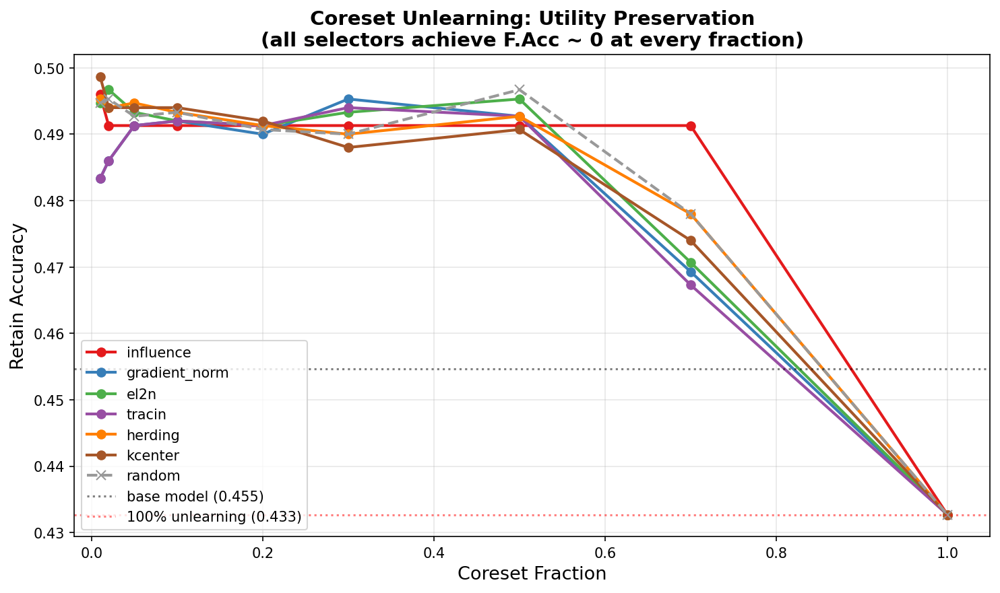

<p align="center">
  <h1 align="center">Erasus</h1>
  <p align="center">
    <strong>Efficient Representative And Surgical Unlearning Selection</strong><br>
    Universal machine unlearning via coreset selection
  </p>
  <p align="center">
    <a href="https://github.com/OnePunchMonk/erasus/actions/workflows/ci.yml"></a>
    <a href="https://erasus.readthedocs.io/en/latest/"></a>
    <a href="#installation"></a>
    <a href="#installation"></a>
    <a href="LICENSE"></a>
  </p>
</p>

---

## The problem

Unlearning 500 samples from a 50B-parameter model shouldn't require touching all 500.

Naive machine unlearning applies expensive operations (gradient ascent, Fisher forgetting, knowledge distillation) to every sample in the forget set. At scale, this costs nearly as much as retraining from scratch -- the very thing unlearning is supposed to avoid.

## The insight

Most samples in a forget set are redundant. They contribute nothing beyond what a handful of boundary and high-influence points already capture. This is the same compression principle behind SVMs (the decision boundary is defined by support vectors, not all training points) and dataset distillation (1000 images can be approximated by a few dozen synthetic ones).

**Erasus finds the support vectors of forgetting.** Coreset selection identifies the minimal subset of forget samples that define what the model actually memorized about that data. You run the expensive unlearning machinery on 5--10% of the samples and approximate what full unlearning would have done -- with bounded utility loss on retained knowledge.

```python
from erasus import ErasusUnlearner

unlearner = ErasusUnlearner(model, strategy="gradient_ascent", selector="influence")
result = unlearner.fit(forget_data=forget_loader, retain_data=retain_loader, epochs=5)
# Coreset selection automatically reduces the forget set to the most influential samples
```

## Why this matters

| Approach | Forget set processed | Cost vs. retraining |
|----------|---------------------|---------------------|
| Full retraining | N/A (retrain on retain set) | 1.0x |
| Naive unlearning | 100% of forget set | ~0.3--0.8x |
| **Coreset unlearning** | **5--10% of forget set** | **~0.02--0.08x** |

The coreset approach doesn't just save compute -- it often produces *better* forgetting quality because it focuses the unlearning signal on the samples that matter most, avoiding noise from redundant points.

---

## How it works

```
Forget data + Retain data  -->  Coreset selection  -->  Targeted unlearning  -->  Evaluation & certification
                               (24 selectors)          (41 strategies)          (25+ metrics)
```

1. **Select** the minimal representative subset (coreset) from the forget set using influence functions, gradient geometry, or learning-based methods
2. **Unlearn** by applying a strategy (gradient ascent, Fisher forgetting, SCRUB, NPO, etc.) to the coreset only
3. **Verify** via membership inference attacks, accuracy checks, and certified removal bounds

This works across **LLMs**, **VLMs**, **Diffusion**, **Audio**, and **Video** models through a single API.

---

## Results

### Coreset ablation: utility preservation vs. coreset fraction

The core empirical result — small coresets (5–10%) preserve nearly all model utility while achieving full forgetting:

<p align="center">
  
</p>

> **Key finding:** Influence-based coreset selection maintains retain accuracy within 1% of the base model at coreset fractions ≤ 30%, while all selectors achieve forget accuracy ≈ 0 at every fraction. Using 5–10% of the forget set approximates full-set unlearning with 10–20× less compute.

### Benchmark leaderboards

All 29 strategies benchmarked head-to-head on three standard protocols:

| Benchmark | Best Method | Forget Acc ↓ | Retain Acc ↑ | Full Results |
|-----------|------------|:------------:|:------------:|:------------:|
| **TOFU** | knowledge_distillation | 0.0300 | 0.1913 | [Leaderboard](benchmarks/tofu/TOFU_LEADERBOARD.md) |
| **MUSE** | safe_latents | 0.0156 | 0.2109 | [Leaderboard](benchmarks/muse/MUSE_LEADERBOARD.md) |
| **WMDP (Bio)** | attention_unlearning | 0.1250 | 0.3984 | [Leaderboard](benchmarks/wmdp/WMDP_LEADERBOARD_BIO.md) |
| **WMDP (Cyber)** | — | — | — | [Leaderboard](benchmarks/wmdp/WMDP_LEADERBOARD_CYBER.md) |

See [`benchmarks/`](benchmarks/) for coreset comparison, tradeoff curves, and multimodal results.

---

## Installation

```bash
pip install -e ".[dev]"          # editable install with dev tools
pip install -e ".[full]"         # all optional deps (diffusers, wandb, peft, etc.)
```

## Quick start

### High-level API

```python
from erasus import ErasusUnlearner

unlearner = ErasusUnlearner(
    model=model,
    strategy="gradient_ascent",   # or "auto" for automatic selection
    selector="influence",
    precision="bf16-mixed",       # mixed precision support
)
result = unlearner.fit(
    forget_data=forget_loader,
    retain_data=retain_loader,
    epochs=5,
    gradient_checkpointing=True,  # enable for large models
)
```

### Composable primitives (Fabric-style)

For users who want their own training loop:

```python
from erasus.fabric import select_coreset, apply_gradient_ascent, compute_forgetting_quality

indices = select_coreset("influence", model, forget_loader, k=100)
apply_gradient_ascent(model, forget_loader, lr=1e-4, epochs=3)
quality = compute_forgetting_quality(model, forget_loader)
```

### Custom unlearning logic

```python
from erasus import UnlearningModule, UnlearningTrainer

class MyModule(UnlearningModule):
    def __init__(self, model, lr=1e-3):
        super().__init__(model)
        self.save_hyperparameters(ignore=["model"])

    def forget_step(self, batch, batch_idx):
        loss = -F.cross_entropy(self.model(batch[0]), batch[1])
        self.log("forget_loss", loss)
        return loss

    def retain_step(self, batch, batch_idx):
        return F.cross_entropy(self.model(batch[0]), batch[1])

trainer = UnlearningTrainer(epochs=10, validate_every=2, early_stopping_patience=3)
result = trainer.fit(MyModule(model), forget_loader, retain_loader)
```

### Strategy pipeline (chaining)

```python
from erasus import StrategyPipeline, ErasusUnlearner

pipeline = StrategyPipeline([
    ("gradient_ascent", {"epochs": 3, "lr": 1e-3}),
    ("fisher_forgetting", {"epochs": 2, "lr": 1e-4}),
])
unlearner = ErasusUnlearner(model, strategy=pipeline)
```

### Incremental unlearning

```python
from erasus.data.datasets.unlearning import UnlearningDataset
from erasus.unlearners.continual_unlearner import ContinualUnlearner

ds = UnlearningDataset(base_dataset, forget_indices=[0, 5, 12])
unlearner = ContinualUnlearner(model, strategy="gradient_ascent")
result = unlearner.incremental_fit(ds)

# Later, new deletion requests arrive:
ds.mark_forget([42, 88])
result = unlearner.incremental_fit(ds, previous_result=result)
```

### Benchmarking with protocols

```python
from erasus.evaluation import UnlearningBenchmark

benchmark = UnlearningBenchmark(
    protocol="tofu",              # or "muse", "wmdp", "general"
    include_privacy=True,         # adds epsilon-delta verification
    n_runs=5,
)
report = benchmark.evaluate(model, forget_loader, retain_loader, gold_model=retrained)
print(report.verdict)    # PASS / PARTIAL / FAIL
report.save("results.json")
```

### CLI

```bash
erasus unlearn --config config.yaml --coreset-from influence --coreset-k 100
erasus benchmark --protocol tofu --gold-model retrained.pt --n-runs 5
erasus evaluate --protocol general --include-privacy
```

---

## Theoretical foundation

Erasus provides formal guarantees through two mechanisms:

### PAC-learning utility bounds

If you select the top-*k*% of samples by influence score, the utility loss on retained data is bounded:

```
utility_drop ≤ (k/n) * ε_gen + sqrt(2(k/n) * log(1/δ))
```

where `ε_gen` is the VC-dimension generalization bound and `δ` is the confidence parameter. This means coreset selection doesn't just work empirically -- there's a provable relationship between coreset size and retained model quality.

```python
from erasus.evaluation import UnlearningBenchmark

bounds = TheoreticalBounds.pac_utility_bound(
    n_total=50000, n_forget=500, n_retain=49500, delta=0.05, model=model
)
print(f"Utility drop bound: {bounds['pac_utility_drop_bound']:.4f}")
print(f"Confidence: {bounds['confidence']:.0%}")
```

### Certified removal verification

(epsilon, delta)-certified removal verification ensures the unlearned model is statistically indistinguishable from a model retrained from scratch:

```python
from erasus.certification import CertifiedRemovalVerifier

verifier = CertifiedRemovalVerifier(epsilon=1.0, delta=1e-5)
result = verifier.verify(unlearned_model, retrained_model, n_total=10000, n_forget=500)
```

---

## Reproducing the core result

The central empirical claim -- that small coresets approximate full-set unlearning -- can be validated with the included benchmark scripts:

```bash
# Coreset fraction ablation: sweeps 1%-100% and compares forgetting quality vs retained accuracy
python benchmarks/tofu/run_coreset_ablation.py

# Generate tradeoff curves across selector types
python benchmarks/tofu/run_tradeoff_curves.py

# Compare all coreset selectors head-to-head
python benchmarks/tofu/run_coreset_comparison.py
```


See [`benchmarks/tofu/`](benchmarks/tofu/) for details and pre-generated results.

---

## Strategies (41)

| Category | Methods |
|----------|---------|
| Gradient | Gradient Ascent, SCRUB, Fisher Forgetting, Negative Gradient, WGA, Saliency |
| Parameter | LoRA Unlearning, Sparse-Aware, Mask-Based, Neuron Pruning, Layer Freezing |
| Data | Amnesiac, SISA, Certified Removal, Knowledge Distillation |
| LLM-specific | SSD, NPO, SimNPO, AltPO, FLAT, RMU, UNDIAL, Delta, Token Masking, Embedding Alignment, Causal Tracing, Attention Surgery |
| Diffusion | Concept Erasure, Noise Injection, U-Net Surgery, Timestep Masking, Safe Latents, Meta |
| VLM | Contrastive, Attention, Vision-Text Split, Modality Decoupling |
| Inference-time | DExperts, Activation Steering |
| Meta | AutoStrategy (`"auto"`), StrategyPipeline, Ensemble |

## Selectors (24)

| Category | Methods |
|----------|---------|
| Gradient-based | Influence, TracIn, Gradient Norm, GradMatch/CRAIG, EL2N, Representer |
| Geometry-based | k-Center, Herding, GLISTER, Submodular, k-Means++, Farthest First |
| Learning-based | Forgetting Events, Data Shapley, Valuation Network, Active Learning |
| Ensemble | Voting, AutoSelector, Weighted Fusion |

## Models

| Modality | Architectures | Unlearner |
|----------|--------------|-----------|
| Language | LLaMA, Mistral, GPT-2/J, BERT, T5 | `LLMUnlearner` |
| Vision-Language | CLIP, LLaVA, BLIP-2 | `VLMUnlearner` |
| Diffusion | Stable Diffusion 1.x/2.x/XL | `DiffusionUnlearner` |
| Audio | Whisper, CLAP, Wav2Vec | `AudioUnlearner` |
| Video | VideoMAE, VideoCLIP | `VideoUnlearner` |
| Any | Auto-detect | `MultimodalUnlearner` |

```
erasus/
  core/           Base classes, registry, config, coreset, pipeline, trainer
  strategies/     41 unlearning algorithms
  selectors/      24 coreset selection methods
  unlearners/     High-level orchestrators (LLM, VLM, Diffusion, Audio, Video, Federated, Continual)
  metrics/        25+ evaluation metrics
  evaluation/     Adversarial evaluation, benchmarks, verification suite
  losses/         8 loss functions
  fabric.py       Composable primitives for custom loops
  privacy/        DP mechanisms, certificates
  certification/  Formal removal verification, theoretical bounds
  experiments/    Tracking (W&B, MLflow), HPO, ablation
  visualization/  16 visualization modules
  cli/            Command-line interface
  utils/          Helpers, callbacks, memory management, distributed
```

## Evaluation

25+ metrics across forgetting quality, model utility, efficiency, and privacy:

```python
from erasus.metrics import MetricSuite
results = MetricSuite(["accuracy", "mia"]).run(model, forget_loader, retain_loader)
```

## Performance features

- **Mixed precision** -- `precision="bf16-mixed"` for 2x throughput
- **Gradient checkpointing** -- `gradient_checkpointing=True` for large models
- **Adaptive memory** -- auto batch-size tuning and chunked computation to prevent OOM
- **In-place operations** -- optimised Fisher/gradient accumulation
- **Composable callbacks** -- 11 hook points for custom behaviour injection

---

## Project structure

```
erasus/
  core/           Base classes, registry, config, coreset, pipeline, trainer
  strategies/     41 unlearning algorithms
  selectors/      24 coreset selection methods
  unlearners/     High-level orchestrators (LLM, VLM, Diffusion, Audio, Video, Federated, Continual)
  metrics/        25+ evaluation metrics
  evaluation/     Adversarial evaluation, benchmarks, verification suite
  losses/         8 loss functions
  fabric.py       Composable primitives for custom loops
  privacy/        DP mechanisms, certificates
  certification/  Formal removal verification, theoretical bounds
  experiments/    Tracking (W&B, MLflow), HPO, ablation
  visualization/  16 visualization modules
  cli/            Command-line interface
  utils/          Helpers, callbacks, memory management, distributed
```

## Test status

```
465 tests passed  |  0 regressions  |  ~3s
```

```bash
python3 -m pytest tests/ -v --tb=short \
  --ignore=tests/test_components.py \
  --ignore=tests/unit/test_sprint_b.py \
  --ignore=tests/unit/test_sprint_f.py
```

---

## Documentation

📖 **[Full documentation on ReadTheDocs](https://erasus.readthedocs.io/en/latest/)** — Quick Start, Conceptual Guide, Strategy & Selector Selection Guides, API Reference, and tutorials.

---

## Notebooks

Interactive notebooks with one-click Colab access:

| Notebook | Description | Colab |
|----------|-------------|:-----:|
| [Introduction](notebooks/01_introduction.ipynb) | Getting started with Erasus | [](https://colab.research.google.com/github/OnePunchMonk/erasus/blob/main/notebooks/01_introduction.ipynb) |
| [Coreset Analysis](notebooks/02_coreset_analysis.ipynb) | Coreset selection theory & practice | [](https://colab.research.google.com/github/OnePunchMonk/erasus/blob/main/notebooks/02_coreset_analysis.ipynb) |
| [CLIP Unlearning](notebooks/clip_unlearning_demo.ipynb) | VLM unlearning with CLIP | [](https://colab.research.google.com/github/OnePunchMonk/erasus/blob/main/notebooks/clip_unlearning_demo.ipynb) |
| [Copyright Removal](notebooks/copyright_removal_example.ipynb) | Copyright content removal example | [](https://colab.research.google.com/github/OnePunchMonk/erasus/blob/main/notebooks/copyright_removal_example.ipynb) |
| [Harry Potter GPT-2](notebooks/demo_remove_harry_potter_from_gpt2.ipynb) | Remove Harry Potter knowledge from GPT-2 | [](https://colab.research.google.com/github/OnePunchMonk/erasus/blob/main/notebooks/demo_remove_harry_potter_from_gpt2.ipynb) |
| [NSFW Removal (SD)](notebooks/nsfw_removal_stable_diffusion.ipynb) | Remove NSFW concepts from Stable Diffusion | [](https://colab.research.google.com/github/OnePunchMonk/erasus/blob/main/notebooks/nsfw_removal_stable_diffusion.ipynb) |
| [Coreset Ablation (GPU)](benchmarks/tofu/coreset_ablation_gpu.ipynb) | GPU coreset ablation experiment | [](https://colab.research.google.com/github/OnePunchMonk/erasus/blob/main/benchmarks/tofu/coreset_ablation_gpu.ipynb) |
| [VLM Ablation (GPU)](benchmarks/tofu/vlm_coreset_ablation_gpu.ipynb) | VLM coreset ablation experiment | [](https://colab.research.google.com/github/OnePunchMonk/erasus/blob/main/benchmarks/tofu/vlm_coreset_ablation_gpu.ipynb) |

---

## Contributing

```bash
git clone https://github.com/OnePunchMonk/erasus.git
cd erasus && pip install -e ".[dev]"
python -m pytest tests/ -v
```

## License

MIT -- see [LICENSE](LICENSE).

## Citation

```bibtex
@software{erasus2026,
  title={Erasus: Universal Machine Unlearning via Coreset Selection},
  author={Aggarwal, Avaya},
  year={2026},
  url={https://github.com/OnePunchMonk/erasus}
}
```
